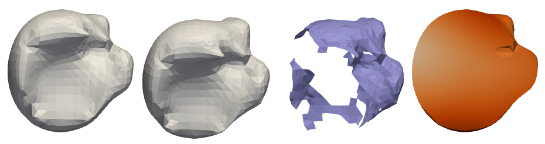

# Open Simulation Pipeline for Generating Synthetic Deforming Organs

Create non-rigid deformations of synthetic or real bodies to generate training data for machine learning problems



## Requirements

### Python VTK bindings:

```bash
    python3 -m pip install vtk matplotlib
```

### Blender3D:

Tested with version 3.4. Please note that previous as well as later versions might not work due to API changes.

At the point of writing (may change in the future), some dependencies need to be installed for the python version that ships with blender!
If you have downloaded blender manually and extracted it to `~/Software/`, you'll find the python executable at a path similar to `~/Software/blender-3.4.1-linux-x64/3.4/python/bin/python3.10`. Run:
```bash
    ~/Software/blender-3.4.1-linux-x64/3.4/python/bin/python3.10 -m ensurepip
    ~/Software/blender-3.4.1-linux-x64/3.4/python/bin/python3.10 -m pip install PyYAML numpy natsort
```
Other packages may be required depending on your setup, which you will notice when you run the pipeline and Blender scripts fail when importing things. Please install them in the same way (and let us know so we can add them to the list!)

#### At NCT:
On our internal NCT drives, blender is already available at `/mnt/ceph/tco/TCO-Staff/Homes/pfeiffemi/Software/Blender/blender-3.4.1-linux-x64/` and it already has the dependencies needed - just make sure to prepend this path in your `$PATH` variable. Afterwards run `which blender` to ensure this blender version is picked up (and not a system installed version in `/usr/bin`).

### SofaPython3 Framework

https://sofapython3.readthedocs.io/en/latest/index.html

Note that there are multiple ways to install SofaPython3. The method we chose was to compile Sofa (v22.12) ourselves and check the "PLUGIN_SOFAPYTHON3" option, however, other methods should work as well.

We currently use the Pardiso solver, instructions on how to install it can be found at https://panua.ch/pardiso/
Note that this may not be mandatory, you could use a different solver.

#### At NCT:
On our internal NCT drives, the required Sofa is already installed at `/mnt/ceph/tco/TCO-Staff/Homes/pfeiffemi/Software/Sofa/sofa/install_v22.12`.
Simply the following code to make it available (or add it to .bashrc). Make sure to change the path to Pardiso to the path where you have downloaded the Pardiso solver.

```bash
    # Sofa path:
    export LD_LIBRARY_PATH=/home/pfeiffemi/Software/Pardiso:$LD_LIBRARY_PATH    # Change!
    export SOFA_ROOT="/mnt/ceph/tco/TCO-Staff/Homes/pfeiffemi/Software/Sofa/sofa/install_v22.12"
    echo "SOFA ROOT:" $SOFA_ROOT
    echo "PYTHONPATH:" $PYTHONPATH
    export PYTHONPATH=$SOFA_ROOT/plugins/SofaPython3/lib/python3/site-packages:$PYTHONPATH
```


## Running

Here are some examples of how to run the pipeline:

```bash
    # Run sample pipeline with dummy blocks:
    python3 src/run_sample.py --data_path data/sample_data --num_samples 10

    # Run rigid displacement sample pipeline:
    python3 src/run_rigid_displacement.py --data_path data/rigid --num_samples 10

    # Run sample pipeline for adipose tissue:
    python3 src/run_fat_manipulation.py --data_path data/adipose --num_samples 100


```

## License:

The main project is licensed under MIT license, see License_MIT.txt. However, scripts using the Blender API (i.e. everything importing 'bpy' or 'bmesh') are licensed under GPL3, to adhere to Blender's license requirements, see License_GPL3.txt.

## Documentation:

### Online documentation:

Documentation can be found at:
https://open-simulation-pipeline-for-generating-synthetic-deforming-org.readthedocs.io/en/latest/

### You can also build the documentation locally:

```bash
    # Install Sphinx
    python3 -m pip install Sphinx sphinx-rtd-theme

    # Optional: Some parts of the pipeline require Blender's bpy module. Since this can be quite difficult to obtain
    # (see also https://wiki.blender.org/wiki/Building_Blender/Other/BlenderAsPyModule) we instead use the fake-bpy-module
    # which will sphinx allow to import the (fake) bpy for building the documentation. If you don't do this, the docs for
    # some scripts will not not be built, but the rest should work fine:
    python3 -m pip install fake-bpy-module-2.80
    
    # Using the makefile from docs/Makefile generate documentation
    cd docs && make html
    
    # This will build HTML docs in the docs/build directory. The landing page can then be found at docs/build/html/index.html.
```
When adding new modules, they can be auto-documented using sphinx-apidoc (may have to remove existing files before):
```bash
    # Re-generate the documentation files for all sub-packages:
    # (Assumes you're in the 'docs' directory!)
    SPHINX_APIDOC_OPTIONS=members,show-inheritance sphinx-apidoc -f -o source/api ../src/ ../src/run_*
```

## Pipeline Development:
Please see [Development](Development.md) for coding conventions.

